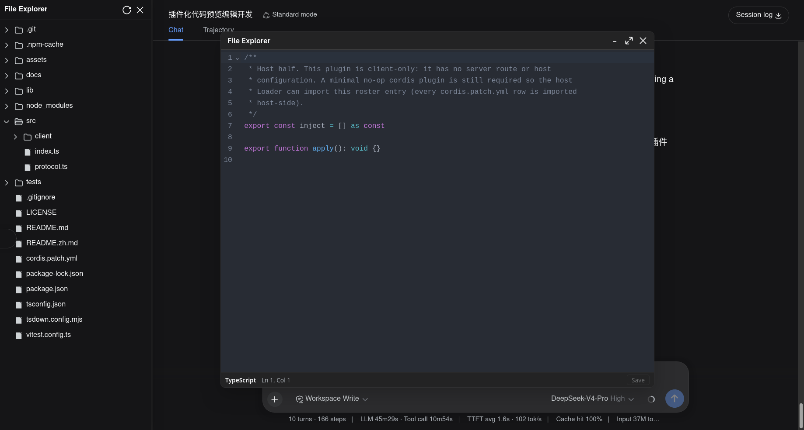
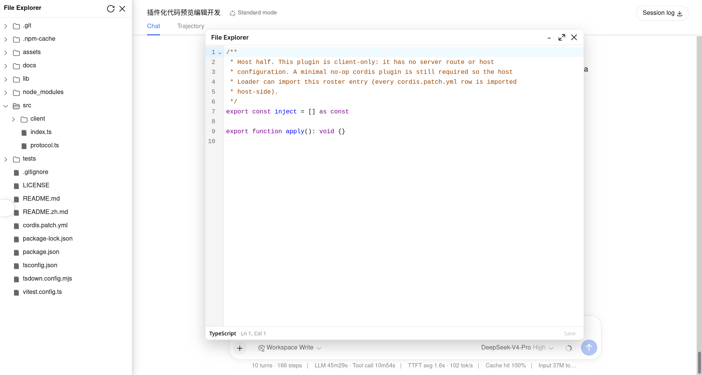

# dsh-file-explorer-preview-code

[中文](README.zh.md) | English

A [CodeMirror 6](https://codemirror.net/) code preview and editor for DSH Web, built on `codemirror` (`basicSetup`) + `@codemirror/language-data` (per-language highlighting) + `@codemirror/theme-one-dark` (dark theme). It overrides [dsh-file-explorer](https://github.com/wolfsonliu/dsh-file-explorer)'s built-in plain-text preview (priority `0`) at priority `10`, giving code files syntax highlighting plus in-place editing with autosave.

## Screenshots

| Dark theme | Light theme |
| --- | --- |
|  |  |

## Features

1. **Syntax highlighting**: resolves the language from the file name via `@codemirror/language-data` (~90 languages), so `.ts`/`.tsx`/`.js`/`.jsx`/`.json`/`.css`/`.html`/`.py`/`.yaml`/`.yml`/`.toml`/`.sh`/`.go`/`.rs`/`.java`/`.c`/`.cpp`/`.h`/`.xml`/`.sql`/`.ini` each get the right tokens.
2. **In-place editing**: the preview is a real CodeMirror editor (line numbers, undo/redo, line wrapping), not a read-only `<pre>`.
3. **Autosave**: edits save 500ms after the last keystroke, plus `Ctrl/Cmd+S` saves immediately.
4. **Save status bar**: a slim footer shows the language, `Ln/Col` cursor position, and the save state (`Unsaved` / `Saving…` / `Saved` / `Save failed`) with a manual Save button.
5. **Theme-aware**: highlighting follows DSH's dark/light toggle (`data-ds-dark-theme`) live.
6. **Extensible by design**: registers through the `fileExplorer` service, so the core file explorer is untouched.

## Dependencies

This plugin **requires** [`@dsh-external/dsh-file-explorer`](https://github.com/wolfsonliu/dsh-file-explorer) — it injects the `fileExplorer` cordis service, which provides `registerPreview` and `writeFile` (the save path). Install and enable `dsh-file-explorer` before this plugin:

```sh
git clone https://github.com/wolfsonliu/dsh-file-explorer.git
cd dsh-file-explorer
npm install && npm run build
dsh plugin --profile web add .
```

> `@dsh-external/dsh-file-explorer` is installed from git (`github:wolfsonliu/dsh-file-explorer`) so `tsc` resolves its `./client` type definitions. To develop against an unpublished local checkout instead, point that dependency at your own path.

## Install

From the git repository:

```sh
git clone https://github.com/wolfsonliu/dsh-file-explorer-preview-code.git
cd dsh-file-explorer-preview-code
npm install && npm run build
dsh plugin --profile web add .
dsh web
```

## How it works

The client entry injects `fileExplorer` and `locale`, then registers one `CodePreview` component for every code extension at priority `10`:

```typescript
export const inject = ['fileExplorer', 'locale']

export function apply(ctx) {
  ctx.effect(() => {
    const component = makeCodePreview(ctx.fileExplorer.writeFile, ctx.locale.bind(CODE_NS))
    const disposers = CODE_EXTS.map(ext => ctx.fileExplorer.registerPreview(ext, component, 10))
    return () => { for (const d of disposers) d() }
  })
}
```

Registered extensions (`CODE_EXTS`): `ts tsx js jsx json css html py yaml yml toml env sh go rs java c cpp h xml sql graphql cfg ini`.

The editor component only ever receives `preview.kind === 'text'` (the core routes `empty` / `binary` / `too-large` / `image` to its own previews first). Edits flow back through `fileExplorer.writeFile(filePath, content)`.

## Configuration

The bundle inserts a single roster row (no host-side configuration):

```yaml
- insert:
    - id: file-explorer-preview-code
      name: '@dsh-external/dsh-file-explorer-preview-code'
```

## Language coverage

`@codemirror/language-data` matches 21 of the 24 extensions to a language. `env` and `graphql` have no language support and open as a plain (un-highlighted) editable buffer; `cfg` matches language-data's legacy `TTCN_CFG` (a matching artifact, not a semantic `ini` match). All still open in the editor.

## Known Limitations

- **Bundle size**: all `@codemirror/*` language packages are inlined into a single `lib/client.js` (~2.7 MB raw, loaded lazily on demand).
- **No Markdown**: `.md`/`.mdx` stay with dsh-file-explorer's built-in markdown preview.
- **Write-through**: editing writes directly back to the workspace file; there is no diff/preview-before-save or multi-tab.
- **Large files**: files above dsh-file-explorer's `maxTextBytes` are already rejected by the core before reaching this plugin.

## Developing preview plugins

This repo is the reference implementation for building a preview plugin. See [docs/developing-preview-plugins.md](docs/developing-preview-plugins.md) ([中文](docs/developing-preview-plugins.zh.md)) for the contract, a minimal skeleton, bundling notes, and i18n.

## Related

- [dsh-file-explorer](https://github.com/wolfsonliu/dsh-file-explorer) — the core file explorer this plugin extends.
- [dsh-file-explorer-preview-code](https://github.com/wolfsonliu/dsh-file-explorer-preview-code) — this repository.
- [dsh-file-explorer-preview-molstar](https://github.com/wolfsonliu/dsh-file-explorer-preview-molstar) — a Mol* structure preview for `.cif`/`.pdb`, built on the same `fileExplorer` contract.

## Development

```sh
npm install
npm run check     # tsc type check
npm test          # vitest unit tests
npm run build     # tsc + tsdown (host ESM stub + client CJS bundle)
```

> After `npm run build`, hard-refresh the browser (`Ctrl/Cmd+Shift+R`): `dsh web` may keep serving a cached plugin bundle, so a soft reload can leave your latest build unused.

## License

[MIT](LICENSE)
